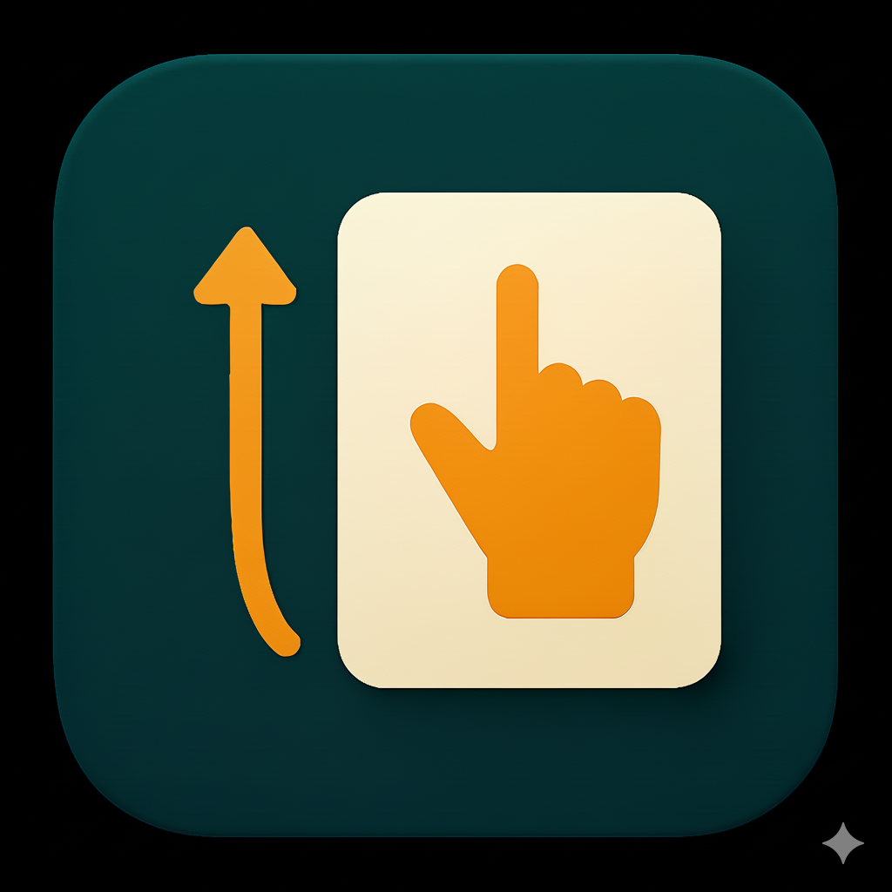

<p align="center">
  
</p>

<h3 align="center">Remote Scroll — Gesture-based Auto Scroller</h3>

<p align="center">
  Scroll any screen without touching it —<br>
  using real-time hand-gesture recognition powered by MediaPipe & CameraX.<br><br>
  <b>v0.1.0 (Release)</b>
  <br> <strong>Android Foreground Camera + Accessibility Service</strong><br><br>
  <a href="https://github.com/egu1832/dual-pdf-viewer/issues/new?labels=bug&template=bug_report.yml">Report bug</a>
  ·
  <a href="https://github.com/egu1832/dual-pdf-viewer/issues/new?labels=enhancement&template=feature_request.yml">Request feature</a>
</p>

---

## Demo

<p align="center">
  
</p>


## Features

remote-scroll은 **손가락 제스처(☝️ Pointer)를 카메라로 인식하여**
웹 브라우저/문서/앱 화면을 **손 움직임만으로 스크롤**할 수 있는 Android 보조 도구입니다.

### **Real-time Hand Gesture Recognition**

* MediaPipe HandLandmarker 로 손 21개 랜드마크 추적
* Custom Keypoint Classifier 로
  **Pointer / Open / Close** 동작 분류
* 안정적인 스크롤을 위한
  **보간(smoothing) + motion consistency** 적용

### **Foreground Camera Service**

* CameraX 기반 실시간 프레임 캡처
* Android 14 대응: `FOREGROUND_SERVICE_CAMERA`
* 백그라운드에서도 안정적으로 동작

### **Accessibility Gesture Injection**

* “Up / Down” 제스처 → 시스템 스크롤 이벤트 실행
* 완전한 시스템 레벨 스크롤 지원
  (크롬, 인스타그램, 노션 등 전 앱 지원)

### **(Hands-free Stop Gesture)**

* 일정 시간 동안 **Open 제스처 유지 → 서비스 자동 종료**

### **Modern Material Design UI**

* PowerToys 스타일 Card UI
* Material Switch 기반 토글
* One UI 스타일 다크 테마 지원


## Tech Stack


## Directory Structure

```
remote-scroll/
├── app/
│   ├── src/
│   │   ├── main/
│   │   │   ├── AndroidManifest.xml    /* Foreground + Accessibility services */
│   │   │   ├── java/com/example/...   /* Camera service, analyzer, UI */
│   │   │   ├── res/layout/            /* PowerToys-style UI */
│   │   │   └── res/drawable/          /* Icons, shapes */
│   ├── build.gradle.kts
│   └── ...               
├── README.md
├── icon.png                           /* App icon */
└── demo.gif                            /* Demo video (optional) */
```


## Security

Remote Scroll은 **카메라 영상과 손 랜드마크를 디바이스 내부에서만 처리**합니다.

✔ 데이터는 외부 서버로 전송되지 않습니다  
✔ 오직 Foreground Service + ML Inference 로 local 상태로 유지됨  
✔ Accessibility Service는 *스크롤 이벤트만 수행하고 UI 내용은 읽지 않음*

개인 연구·포트폴리오용으로 안전하게 사용할 수 있습니다.


## Installation (APK)

### 1. 개발자 모드 → Unknown App 허용

설정 → 보안 → **출처를 알 수 없는 앱 설치 허용**

### 2. Google Play Protect에서 차단 시

Google Play → 오른쪽 상단 프로필 → Play 프로텍트 → 우측 상단 톱니바퀴 →
**“Play Protect로 앱 검사” 비활성화**

> Android 13+에서는 카메라 + 접근성 + 포그라운드가 동시에 있는 앱은
> 개발자 서명이 있어도 Play Protect가 차단할 수 있습니다.

##  Usage

### 1️. 앱 실행하기

앱을 실행하면 아래와 같은 두 가지 버튼이 보입니다:

* **Gesture Service** (ON/OFF)
* **접근성 권한 설정**

### 2️. 접근성 권한 활성화 (필수)

#### ① 접근성 권한 카드 누르기

앱 화면 →
**"접근성 권한 설정" 카드**를 탭합니다.

#### ② Android 설정으로 이동됨

경로:

```
설정 → 접근성 → 설치된 앱 → remote-scroll
```

#### ③ 아래 옵션을 켜주세요

* **접근성 서비스 활성화**
* 화면 상호작용 허용
* 제어 권한 허용

> *remote-scroll은 화면 조작(스크롤)만을 위해 접근성을 사용하며,
> 모든 정보는 기기 내부에서만 처리됩니다.*


### 3️. 카메라 권한 허용 (필수)

Gesture Service 버튼을 눌러 기능 첫 실행 시 다음 권한 요청이 뜹니다:

* **카메라 권한**

전면 카메라를 사용해 손 제스처를 인식하므로 반드시 허용해야 합니다.


### 4️. Gesture Service 켜기

앱의 첫 번째 카드에서:

```
Gesture Service   [   ⚫ OFF → 🟡 ON   ]
```

스위치를 켜면:

* 전면 카메라가 활성화됨
* 손 제스처 감지가 시작됨
* UP / DOWN 제스처에 따라 스크롤 수행

> 이 과정에서 상단바에 카메라가 실행중이라는 초록색 표시와
> 백그라운드 작동 중이라는 어플리케이션 알림이 표시됩니다.


### 5️. 스크롤 제스처 사용하기

#### Pointer(☝️) 포즈로 시작

✊ Close 모양 → **☝️ Pointer 모양** → 동작

#### 동작 예시

| 손동작            | 동작     | 실행되는 동작             |
| -------------- | ------ | ------------------- |
| 손가락을 위로 올림     | Up     | 화면 아래로 스크롤          |
| 손가락을 아래로 내림    | Down   | 화면 위로 스크롤           |

#### 제스처 정확도 향상 팁

* 왼손을 사용하는 것이 훨씬 잘 인식됩니다
* 두 손이 동시에 프레임에 들어오지 않는 편이 좋습니다
* 화면과 30–70cm 거리를 유지해주세요

### 6️. 서비스 종료하기 ★

앱 → **Gesture Service 토글 OFF**


## License

MIT License — 개인/교육/연구 목적 무료 사용 가능.

